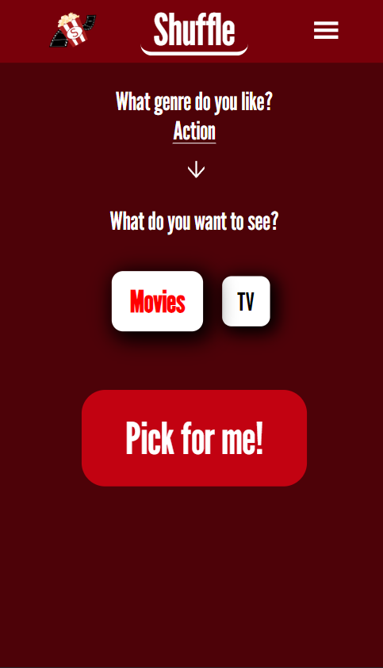
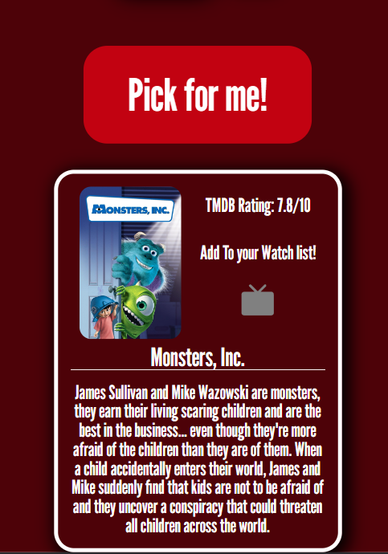
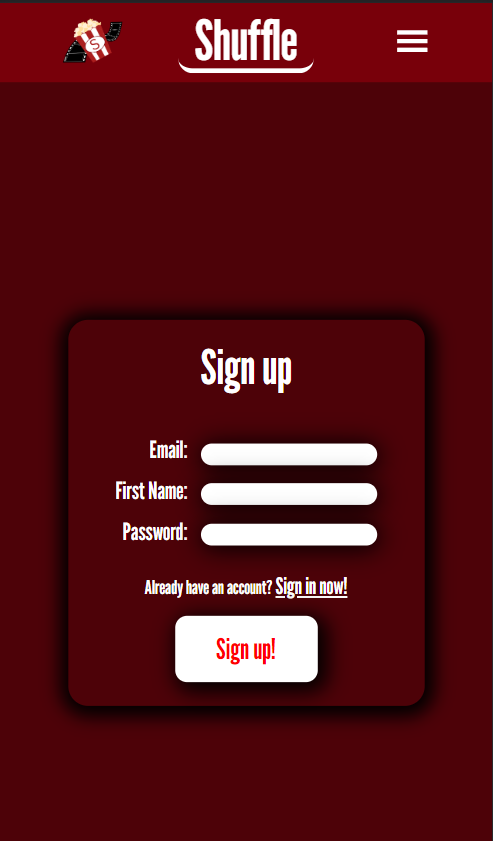
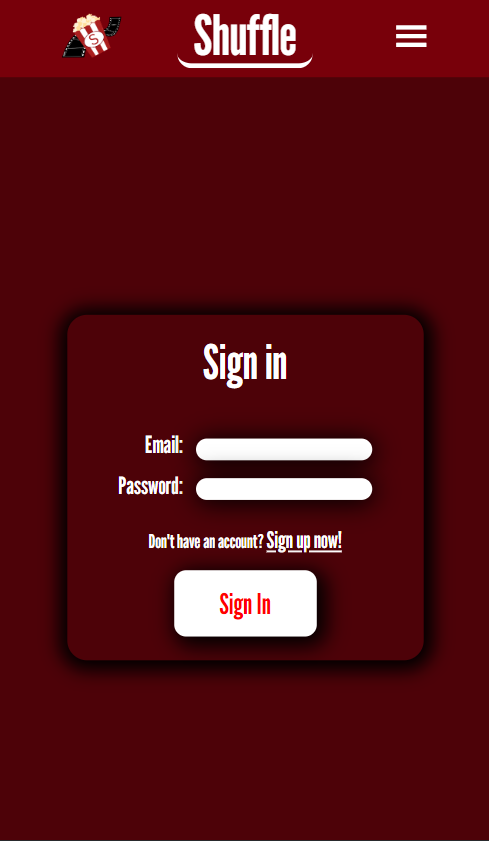
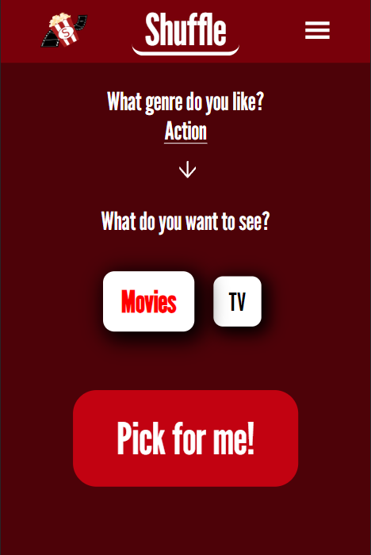
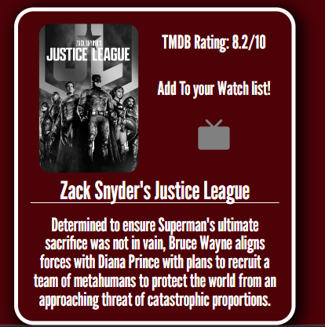
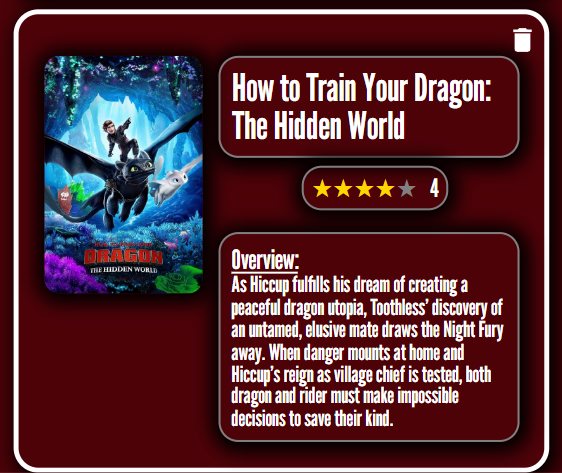
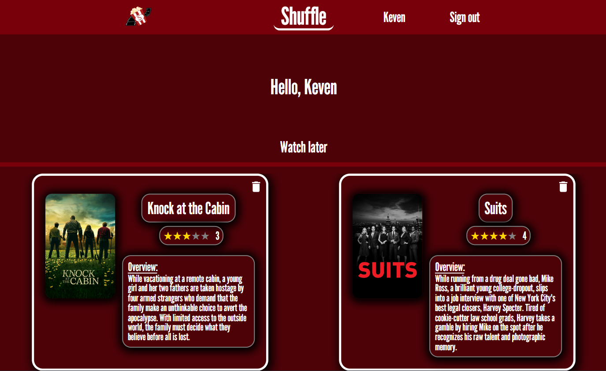

# Final Project "Shuffle"

 

# Summary

This application functions as a random movie/tv show selector. it allows you to filter by genre and by type of media (movie or Tv show)
and generates you a random pick to help people stop endlessly scrolling movie apps. 

# Features

1. Sign up 

2. Sign in/ sign out

3. Button that generates a random result 

4. 2 filters for said button, one for genre and one for type of media (movie or tv show)

5. Ability to save any movie or tv show to personal "Watch Later" list and to view said list on the profile page

6. Ability to remove any movie or tv show from personal "Watch Later" list

7. Rating system for every item saved to watch later. Can rate them out of 5 stars

# APIs and Packages used

`API`: "The Movie DataBase API" used to get database of movies and tv shows. also provides items with a rating from their website.

`Packages`: 

1. Styled-components
2. UUID
3. GlobalStyles
4. bcrypt
5. React-Icons
6. React-Router-Dom
